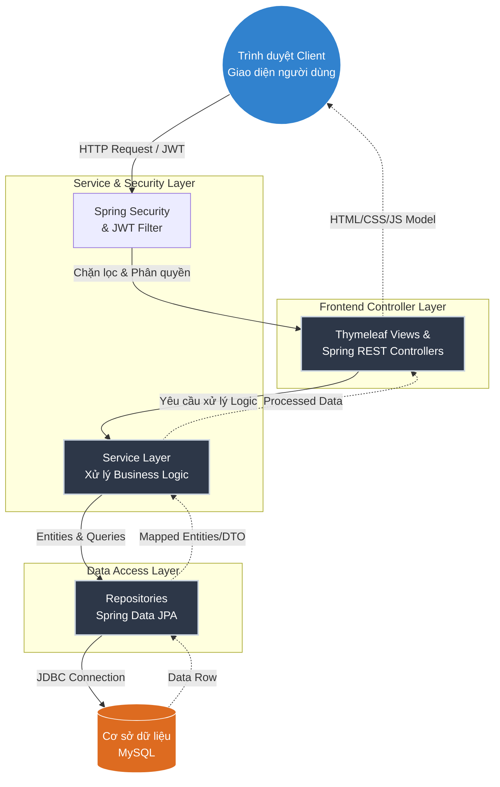
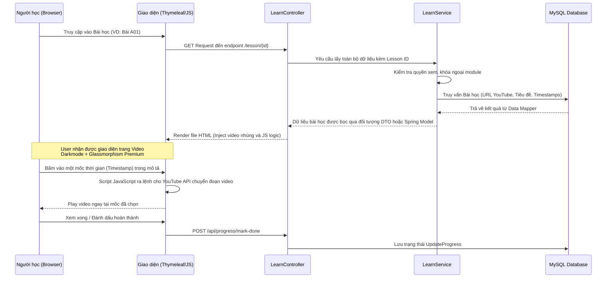
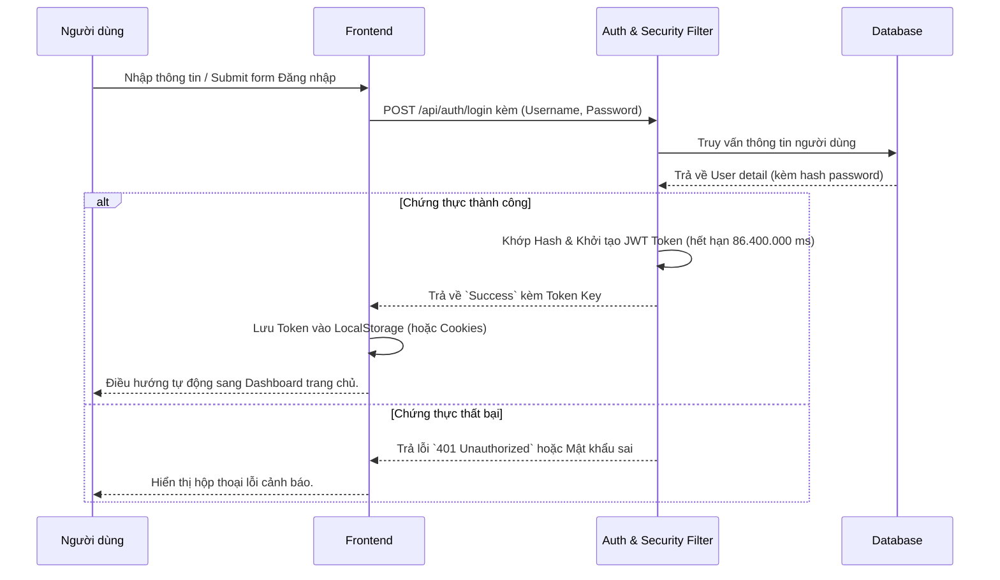

# Group 19 - Cyber Security Learning Web App

## 1. Tổng quan dự án

Dự án **Cyber Security Learning Web App** là một nền tảng giáo dục trực tuyến toàn diện, chuyên biệt về lĩnh vực An toàn Thông tin (Cyber Security).

Hệ thống được xây dựng nhằm cung cấp một môi trường học tập, thực hành và thi đấu trọn vẹn dành cho người học an toàn thông tin. Các tính năng nổi bật bao gồm:

- **Hệ thống bài học (Learn & Modules):** Trình bày trực quan với các bài giảng video (tích hợp API YouTube với tính năng chuyển hướng video theo các mốc thời gian - timestamps).
- **Trắc nghiệm & Thực hành (Quiz & Lab):** Cho phép kiểm tra kiến thức và thực hành ngay trên nền tảng.
- **Thử thách thi đấu (Compete):** Tạo môi trường rèn luyện các kỹ năng bảo mật (có thể theo hướng CTF - Capture The Flag).
- **Theo dõi tiến độ học tập (Progress & Dashboard):** Cung cấp biểu đồ và chỉ số chính xác để người học nắm bắt lộ trình của bản thân.
- **Giao diện người dùng (UI):** Thiết kế hiện đại mang phong cách không gian mạng, sử dụng Dark Mode và layout Glassmorphism để tối ưu hóa trải nghiệm thị giác (Premium UX).

---

## 2. Công nghệ sử dụng

Dự án áp dụng các kỹ thuật và framework mạnh mẽ, phổ biến để đảm bảo tính sẵn sàng, bảo mật và khả năng mở rộng.

- **Ngôn ngữ lập trình chính:** Java (Phiên bản 21), JavaScript, HTML5, CSS3.
- **Backend (Máy chủ):**
  - **Framework Backend:** Spring Boot (v3.5.12).
  - **Web & API:** Spring Web, xây dựng theo chuẩn RESTful API.
  - **Bảo mật:** Spring Security kết hợp cơ chế kiểm tra quyền truy cập JWT (JSON Web Token) trong việc xác thực người dùng.
  - **Truy xuất dữ liệu:** Spring Data JPA kết hợp Hibernate để tương tác hướng đối tượng với Database.
- **Frontend (Giao diện người dùng):**
  - **Server-Side Rendering Template:** Thymeleaf (Tích hợp liền mạch với hệ sinh thái Spring).
  - **Thiết kế & Tương tác:** Sử dụng HTML5, CSS thuần (tạo hiệu ứng chuyển động, hover, dark UI, glassmorphism) và Vanilla JavaScript.
- **Cơ sở dữ liệu (Database):**
  - **Database chính thức:** MySQL (Liên kết qua thư viện `mysql-connector-j`).
  - **Testing Database:** H2 Database (In-memory, giúp chạy test-case độc lập).
- **Quản trị và Build Tools:** Maven.

---

## 3. Hướng dẫn cài đặt & Chạy dự án

### 3.1. Yêu cầu trước khi chạy

| Thành phần | Yêu cầu                                                      |
| ---------- | ------------------------------------------------------------ |
| **Java**   | JDK 21 trở lên                                               |
| **MySQL**  | Đang chạy trên `localhost:3306`                              |
| **Maven**  | Không cần cài — dự án đã tích hợp sẵn Maven Wrapper (`mvnw`) |

### 3.2. Tạo Database

Mở terminal MySQL (hoặc công cụ quản lý như MySQL Workbench, DBeaver, phpMyAdmin…) và chạy:

```sql
CREATE DATABASE blogweb;
```

### 3.3. Cấu hình kết nối Database

File cấu hình nằm tại `src/main/resources/application.properties`, mặc định đang để:

| Thuộc tính | Giá trị mặc định                      |
| ---------- | ------------------------------------- |
| URL        | `jdbc:mysql://localhost:3306/blogweb` |
| Username   | `root`                                |
| Password   | `mat_khau_cua_ban`                    |

> ⚠️ **Lưu ý:** Nếu mật khẩu MySQL của bạn khác, hãy mở file `src/main/resources/application.properties` và sửa lại giá trị `spring.datasource.password` cho phù hợp.

### 3.4. Chạy ứng dụng

Mở terminal tại thư mục gốc của dự án và chạy lệnh sau:

**Windows (CMD / PowerShell):**

```bash
.\mvnw.cmd spring-boot:run
```

**macOS / Linux:**

```bash
./mvnw spring-boot:run
```

Đợi đến khi thấy log hiển thị dòng tương tự:

```
Started CyberSecApplication in X.XXX seconds
```

### 3.5. Truy cập ứng dụng

Sau khi khởi động thành công, mở trình duyệt và truy cập:

---

## 4. Cấu trúc mã nguồn

Mã nguồn được thiết kế tổ chức theo **Feature-based Packaging** (chia package theo từng chức năng). Điều này giúp code dễ bảo trì hơn theo mô hình MVC nâng cao.

```text
📦 Group_19_CyberSecurityLearingWebApp
├── 📜 pom.xml                      # Quản lý thư viện dependencies và cấu hình build dự án (Maven)
├── 📂 src                          # Thư mục mã nguồn chính
│   ├── 📂 main
│   │   ├── 📂 java
│   │   │   └── 📂 com.example.cybersec
│   │   │       ├── 📜 CyberSecApplication.java # Entry point khởi động Spring Boot
│   │   │       ├── 📂 auth          # Quản lý luồng đăng nhập, đăng ký, khởi tạo và lọc JWT
│   │   │       ├── 📂 common        # Hằng số, Config toàn chuẩn, Xử lý Exception, Utilities
│   │   │       ├── 📂 compete       # Quản lý chức năng thi đấu (CTF, leaderboard)
│   │   │       ├── 📂 dashboard     # Thống kê, quản lý dashboard giao diện chính
│   │   │       ├── 📂 home          # Route trang chủ
│   │   │       ├── 📂 lab           # Xử lý nội dung thực hành (Labs)
│   │   │       ├── 📂 learn         # Logic các trang nội dung học tập, bài giảng video
│   │   │       ├── 📂 module        # Quá trình chia nhỏ khóa học thành các chương
│   │   │       ├── 📂 progress      # Tính toán chi tiết tiến độ hoàn thành bài học
│   │   │       ├── 📂 quiz          # Quản lý ngân hàng câu hỏi, tính điểm câu trả lời
│   │   │       └── 📂 user          # Profile định danh và thông tin mỗi người dùng
│   │   └── 📂 resources
│   │       ├── 📜 application.properties # Cấu hình ứng dụng (DB conection, Port, JWT config...)
│   │       ├── 📂 static             # Các file frontend tĩnh (CSS, JS, Hình ảnh tĩnh, Fonts)
│   │       ├── 📂 templates          # Chứa giao diện file HTML Render bởi Thymeleaf (Layout, Pages)
│   │       └── 📂 db                 # Lịch sử script thao tác với Database (nếu có)
```

---

## 5. Sơ đồ cấu trúc & Hoạt động

Các biểu đồ dưới đây mô tả cách các thành phần trong hệ thống làm việc với nhau. Mã nguồn hoạt động dựa trên mô hình **MVC** mở rộng kết hợp **Repository/Service pattern**.

### 5.1. Sơ đồ Cấu trúc Tổng thể Hệ thống (System Architecture)



### 5.2. Biểu đồ Tuần tự: Luồng Học Bằng Video & Tương Tác Tính Năng (Lesson & Video Flow)

Mô tả cách ứng dụng xử lý khi người dùng tương tác với bài giảng video, một trong tính năng quan trọng nhất để đem lại trải nghiệm tốt cho người học (Tích hợp Timestamp API).



### 5.3. Biểu đồ Tuần tự: Luồng Đăng Nhập & Xác Thực (Authentication Flow)

Mô tả cơ chế xác định chứng thực một chu kỳ kết nối an toàn với Token.


