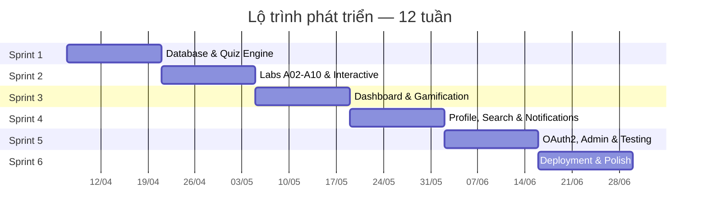

# 📋 Project Plan & Sprint Planning
## OWASP Top 10 — Cybersecurity Learning Web Application

> **Dự án:** Group 19 — S2026_SE2_Group19  
> **Ngày lập:** 07/04/2026  
> **Phương pháp:** Agile Scrum (2 tuần / sprint)  
> **Tổng thời gian dự kiến:** 12 tuần (6 Sprints)

---

## 📑 Mục Lục

1. [Đánh Giá Hiện Trạng Dự Án](#1-đánh-giá-hiện-trạng-dự-án)
2. [Product Vision & Goals](#2-product-vision--goals)
3. [Product Backlog](#3-product-backlog)
4. [Sprint Planning Chi Tiết](#4-sprint-planning-chi-tiết)
5. [Lộ Trình Tổng Quan (Roadmap)](#5-lộ-trình-tổng-quan-roadmap)
6. [Quản Lý Rủi Ro](#6-quản-lý-rủi-ro)
7. [KPI & Metrics](#7-kpi--metrics)
8. [Definition of Done (DoD)](#8-definition-of-done-dod)

---

## 1. Đánh Giá Hiện Trạng Dự Án

### ✅ Đã Hoàn Thành

| # | Tính năng | Trạng thái | Ghi chú |
|---|-----------|------------|---------|
| 1 | Kiến trúc Spring Boot + Thymeleaf | ✅ Hoàn chỉnh | Java 21, Spring Boot 3.5.12 |
| 2 | Hệ thống xác thực (Login/Register) | ✅ Hoàn chỉnh | JWT + Session, BCrypt |
| 3 | Phân quyền Spring Security | ✅ Hoàn chỉnh | Guest/USER/LEARNER |
| 4 | Trang chủ (Guest) + Banner Slider | ✅ Hoàn chỉnh | 3 slide, responsive |
| 5 | 10 bài học OWASP (A01–A10) — Member | ✅ Hoàn chỉnh | Nội dung chi tiết |
| 6 | 10 bài học OWASP (A01–A10) — Guest | ✅ Hoàn chỉnh | Chế độ xem không cần đăng nhập |
| 7 | 10 trang Preview bài học | ✅ Hoàn chỉnh | Tóm tắt trước khi đọc chi tiết |
| 8 | 10 trang Quiz (giao diện) | ✅ Hoàn chỉnh | HTML/CSS đã có |
| 9 | Navbar Guest + Navbar User (responsive) | ✅ Hoàn chỉnh | Desktop + Mobile menu |
| 10 | Dashboard (giao diện) | ✅ Hoàn chỉnh | Greeting, Rooms, League, Sidebar |
| 11 | Trang Profile (Member Home) | ✅ Hoàn chỉnh | Hiển thị thông tin user |
| 12 | Lab Walkthrough A01 (giao diện) | ✅ Hoàn chỉnh | 5 bước hướng dẫn |
| 13 | API Quiz Submit | ✅ Cơ bản | Hardcoded answer key |
| 14 | API Lab Validate | ✅ Cơ bản | Strategy pattern (Exploit/Defense) |
| 15 | API Dashboard Learning Path | ✅ Cơ bản | In-memory modules |
| 16 | API Progress Tracking | ✅ Cơ bản | In-memory (ConcurrentHashMap) |
| 17 | API Modules | ✅ Cơ bản | In-memory data |
| 18 | Lab Strategy Pattern | ✅ Hoàn chỉnh | Factory + Strategy + Context |

### ⚠️ Còn Hạn Chế (Technical Debt)

| # | Vấn đề | Mức độ | Ảnh hưởng |
|---|--------|--------|-----------|
| 1 | **Module/Progress dùng in-memory** (không persist) | 🔴 Cao | Mất dữ liệu khi restart |
| 2 | **Quiz answer key hardcoded** (3 câu cố định) | 🔴 Cao | Không mở rộng được |
| 3 | **Dashboard greeting hardcoded** ("Hey Duy!") | 🟡 Trung bình | Không cá nhân hóa |
| 4 | **Weekly Mission/League tĩnh** | 🟡 Trung bình | Không tương tác thực |
| 5 | **Lab chỉ có A01** (A02–A10 chưa có nội dung) | 🟡 Trung bình | Thiếu nội dung |
| 6 | **Chưa có unit test** | 🟡 Trung bình | Rủi ro regression |
| 7 | **Social login chỉ là UI** | 🟢 Thấp | Tính năng chưa cần thiết ngay |

### ❌ Chưa Triển Khai

| # | Tính năng | Ưu tiên |
|---|-----------|---------|
| 1 | Persist Module & Quiz vào MySQL | 🔴 P0 |
| 2 | Quiz engine động (câu hỏi từ DB) | 🔴 P0 |
| 3 | Lab tương tác cho A02–A10 | 🟡 P1 |
| 4 | Dashboard động (tiến trình thực) | 🟡 P1 |
| 5 | Chỉnh sửa Profile | 🟡 P1 |
| 6 | Đặt lại mật khẩu | 🟡 P1 |
| 7 | Tìm kiếm nội dung | 🟢 P2 |
| 8 | Hệ thống thông báo | 🟢 P2 |
| 9 | Gamification (Points, League thực) | 🟢 P2 |
| 10 | Social Login (OAuth2) | 🟢 P2 |
| 11 | Admin Panel | 🟢 P2 |
| 12 | Chứng chỉ hoàn thành | 🟢 P3 |
| 13 | Unit & Integration Tests | 🟡 P1 |
| 14 | CI/CD & Deployment | 🟢 P2 |

---

## 2. Product Vision & Goals

### Vision Statement

> *"Xây dựng nền tảng học tập an ninh mạng toàn diện, nơi người dùng có thể học lý thuyết, thực hành qua lab tương tác, kiểm tra kiến thức qua quiz, và theo dõi lộ trình học tập — tất cả dựa trên chuẩn OWASP Top 10 (2025)."*

### Goals theo từng sprint



---

## 3. Product Backlog

### Epic 1: 💾 Data Persistence & Foundation (P0)

| ID | User Story | Story Points | Sprint |
|----|------------|:------------:|:------:|
| US-01 | Là developer, tôi muốn chuyển Module từ in-memory sang MySQL Entity để dữ liệu không mất khi restart | 5 | S1 |
| US-02 | Là developer, tôi muốn tạo Entity `Quiz`, `Question`, `Answer` để lưu trữ câu hỏi quiz trong database | 8 | S1 |
| US-03 | Là developer, tôi muốn tạo Entity `QuizResult` để lưu kết quả quiz của user vào database | 5 | S1 |
| US-04 | Là developer, tôi muốn tạo Entity `UserProgress` để lưu tiến trình học tập vào database thay vì ConcurrentHashMap | 5 | S1 |
| US-05 | Là developer, tôi muốn tạo data migration script (SQL) để seed dữ liệu 10 module OWASP và câu hỏi quiz ban đầu | 3 | S1 |

### Epic 2: 📝 Quiz Engine (P0)

| ID | User Story | Story Points | Sprint |
|----|------------|:------------:|:------:|
| US-06 | Là learner, tôi muốn mỗi bài quiz có ít nhất 5 câu hỏi trắc nghiệm lấy từ database để kiểm tra kiến thức sâu hơn | 8 | S1 |
| US-07 | Là learner, tôi muốn xem kết quả quiz ngay sau khi nộp (điểm, đáp án đúng/sai) và nhận phản hồi chi tiết | 5 | S1 |
| US-08 | Là learner, tôi muốn xem lịch sử các lần làm quiz (điểm, thời gian, module) trên trang profile | 3 | S3 |
| US-09 | Là learner, tôi muốn quiz hiển thị giải thích (explanation) cho mỗi đáp án sau khi nộp bài | 5 | S2 |

### Epic 3: 🔬 Lab System (P1)

| ID | User Story | Story Points | Sprint |
|----|------------|:------------:|:------:|
| US-10 | Là learner, tôi muốn có lab tương tác cho A02 (Security Misconfiguration) với kịch bản thực hành | 5 | S2 |
| US-11 | Là learner, tôi muốn có lab tương tác cho A03 (Supply Chain Failures) | 5 | S2 |
| US-12 | Là learner, tôi muốn có lab tương tác cho A04 (Cryptographic Failures) | 5 | S2 |
| US-13 | Là learner, tôi muốn có lab tương tác cho A05 (Injection) với SQL injection sandbox | 8 | S2 |
| US-14 | Là learner, tôi muốn có lab tương tác cho A06–A10 (mỗi lab có Exploit + Defense mode) | 13 | S2 |
| US-15 | Là learner, tôi muốn lab hiển thị kết quả (pass/fail) và ghi nhận vào tiến trình học | 5 | S2 |

### Epic 4: 📊 Dashboard & Gamification (P1)

| ID | User Story | Story Points | Sprint |
|----|------------|:------------:|:------:|
| US-16 | Là learner, tôi muốn Dashboard hiển thị lời chào cá nhân hóa (không hardcoded) dựa trên username đăng nhập | 2 | S3 |
| US-17 | Là learner, tôi muốn Dashboard hiển thị tiến trình thực tế (% hoàn thành, module đã hoàn thành) từ database | 5 | S3 |
| US-18 | Là learner, tôi muốn Weekly Mission cập nhật động: đếm số câu hỏi đã trả lời, điểm tích lũy, phòng đã hoàn thành trong tuần | 8 | S3 |
| US-19 | Là learner, tôi muốn hệ thống tích điểm (Points) cho mỗi quiz pass, lab hoàn thành và tính điểm tích lũy | 5 | S3 |
| US-20 | Là learner, tôi muốn hệ thống League (Bronze/Silver/Gold) dựa trên tổng điểm tích lũy | 5 | S3 |
| US-21 | Là learner, tôi muốn "Your Stats" hiển thị thống kê: tổng thời gian học, streak, average score | 5 | S3 |
| US-22 | Là learner, tôi muốn Dashboard Module List hiển thị trạng thái thực tế từ database với icon trạng thái | 3 | S3 |

### Epic 5: 👤 Profile & Account (P1)

| ID | User Story | Story Points | Sprint |
|----|------------|:------------:|:------:|
| US-23 | Là user, tôi muốn chỉnh sửa thông tin cá nhân (display name, address) trên trang profile | 5 | S4 |
| US-24 | Là user, tôi muốn thay đổi mật khẩu từ trang profile | 5 | S4 |
| US-25 | Là user, tôi muốn đặt lại mật khẩu qua email khi quên | 8 | S4 |
| US-26 | Là user, tôi muốn upload avatar cá nhân thay vì dùng ảnh mặc định | 5 | S4 |

### Epic 6: 🔍 Search & Notifications (P2)

| ID | User Story | Story Points | Sprint |
|----|------------|:------------:|:------:|
| US-27 | Là user, tôi muốn tìm kiếm bài học, quiz, lab theo từ khóa | 8 | S4 |
| US-28 | Là user, tôi muốn nhận thông báo khi hoàn thành module, đạt thành tích mới (bell icon) | 5 | S4 |
| US-29 | Là user, tôi muốn xem danh sách thông báo trong dropdown khi nhấn icon bell | 3 | S4 |

### Epic 7: 🔐 OAuth2 & Admin (P2)

| ID | User Story | Story Points | Sprint |
|----|------------|:------------:|:------:|
| US-30 | Là user, tôi muốn đăng nhập bằng Google OAuth2 | 8 | S5 |
| US-31 | Là admin, tôi muốn có trang Admin Panel để quản lý users | 8 | S5 |
| US-32 | Là admin, tôi muốn quản lý nội dung quiz (CRUD câu hỏi) từ Admin Panel | 8 | S5 |
| US-33 | Là admin, tôi muốn xem thống kê tổng quan: tổng users, quiz attempts, completion rate | 5 | S5 |

### Epic 8: 🧪 Testing & Quality (P1)

| ID | User Story | Story Points | Sprint |
|----|------------|:------------:|:------:|
| US-34 | Là developer, tôi muốn viết unit tests cho các Service classes (≥80% coverage) | 8 | S5 |
| US-35 | Là developer, tôi muốn viết integration tests cho các API endpoints | 5 | S5 |
| US-36 | Là developer, tôi muốn setup CI pipeline (GitHub Actions) để tự động chạy tests | 5 | S5 |

### Epic 9: 🚀 Deployment & Polish (P2)

| ID | User Story | Story Points | Sprint |
|----|------------|:------------:|:------:|
| US-37 | Là developer, tôi muốn containerize ứng dụng bằng Docker (Dockerfile + docker-compose) | 5 | S6 |
| US-38 | Là developer, tôi muốn triển khai ứng dụng lên môi trường staging (VPS/Cloud) | 8 | S6 |
| US-39 | Là learner, tôi muốn trang web hiển thị tải nhanh (< 3s) với gzip/minify CSS/JS | 3 | S6 |
| US-40 | Là learner, tôi muốn nhận chứng chỉ (Certificate) khi hoàn thành toàn bộ 10 module | 8 | S6 |
| US-41 | Là developer, tôi muốn hoàn thiện tài liệu API (Swagger/OpenAPI) | 3 | S6 |
| US-42 | Là learner, tôi muốn trang web hỗ trợ PWA (Progressive Web App) để sử dụng offline | 5 | S6 |

---

## 4. Sprint Planning Chi Tiết

---

### 🏃 Sprint 1: Database & Quiz Engine Foundation
**Thời gian:** 07/04/2026 → 20/04/2026 (2 tuần)  
**Sprint Goal:** *Chuyển toàn bộ dữ liệu từ in-memory sang MySQL và xây dựng quiz engine động.*

#### Sprint Backlog

| ID | Task | Mô tả chi tiết | SP | Assignee | Ngày |
|----|------|-----------------|----|----------|------|
| US-01 | **Module Entity** | Tạo `@Entity Module` với JPA, `ModuleRepository extends JpaRepository`, migration script tạo bảng `modules` | 5 | BE Dev | W1 |
| US-02 | **Quiz/Question/Answer Entities** | Tạo 3 entity: `Quiz` (id, moduleId, title), `Question` (id, quizId, content, explanation), `Answer` (id, questionId, content, isCorrect) | 8 | BE Dev | W1 |
| US-03 | **QuizResult Entity** | Tạo entity `QuizResult` (id, userId, quizId, score, passed, attemptedAt) lưu kết quả | 5 | BE Dev | W1 |
| US-04 | **UserProgress Entity** | Tạo entity `UserProgress` (id, userId, moduleId, status, completedAt, totalPoints) | 5 | BE Dev | W1 |
| US-05 | **Data Seed Script** | Tạo `data.sql` seed 10 modules OWASP + ít nhất 5 câu hỏi/module (50 câu tổng) | 3 | BE Dev | W1-W2 |
| US-06 | **Quiz Engine động** | Refactor `QuizService` đọc câu hỏi từ DB, tính điểm động, hỗ trợ n câu/quiz | 8 | BE Dev | W2 |
| US-07 | **Quiz Result UI** | Sau khi submit quiz, hiển thị popup/page kết quả chi tiết: điểm, câu đúng/sai | 5 | FE Dev | W2 |

**Tổng Story Points:** 39  
**Velocity dự kiến:** 35-40 SP

#### Acceptance Criteria — Sprint 1

```
✅ Restart server → dữ liệu Modules, Quiz, Progress vẫn còn trong MySQL
✅ API GET /api/modules trả về 10 modules từ database
✅ API POST /api/quizzes/submit tính điểm dựa trên câu hỏi từ DB
✅ Quiz có ≥5 câu hỏi cho mỗi module
✅ Kết quả quiz được lưu vào bảng quiz_results
✅ Progress được lưu vào bảng user_progress
✅ FE hiển thị kết quả quiz sau khi nộp bài
```

---

### 🏃 Sprint 2: Labs A02–A10 & Interactive Exercises
**Thời gian:** 21/04/2026 → 04/05/2026 (2 tuần)  
**Sprint Goal:** *Mở rộng lab tương tác cho tất cả 10 chủ đề OWASP và thêm giải thích quiz.*

#### Sprint Backlog

| ID | Task | Mô tả chi tiết | SP | Assignee | Ngày |
|----|------|-----------------|----|----------|------|
| US-10 | **Lab A02: Security Misconfiguration** | Tạo lab simulation: Debug mode detection, Default credentials check | 5 | FE+BE | W3 |
| US-11 | **Lab A03: Supply Chain** | Lab: kiểm tra dependency version, phát hiện package giả mạo | 5 | FE+BE | W3 |
| US-12 | **Lab A04: Cryptographic Failures** | Lab: so sánh MD5 vs BCrypt, phát hiện plaintext password | 5 | FE+BE | W3 |
| US-13 | **Lab A05: Injection** | Lab: SQL injection sandbox với input field và kết quả trả về | 8 | FE+BE | W3-W4 |
| US-14 | **Labs A06–A10** | Tạo 5 lab còn lại (mỗi lab có Exploit mode + Defense mode) | 13 | FE+BE | W4 |
| US-15 | **Lab Result Tracking** | Lab pass/fail → ghi nhận vào UserProgress trong DB | 5 | BE Dev | W4 |
| US-09 | **Quiz Explanation** | Sau khi nộp quiz, hiển thị giải thích (explanation) cho mỗi đáp án | 5 | FE Dev | W4 |

**Tổng Story Points:** 46  
**Velocity dự kiến:** 40-48 SP

#### Acceptance Criteria — Sprint 2

```
✅ Tất cả 10 lab A01–A10 có nội dung và có thể truy cập
✅ Mỗi lab có ít nhất Exploit mode hoạt động
✅ Lab A05 (Injection) có SQL injection sandbox thực sự
✅ Kết quả lab được ghi nhận vào database
✅ Quiz hiển thị explanation sau khi nộp bài
✅ Lab strategy pattern hỗ trợ thêm lab types mới
```

---

### 🏃 Sprint 3: Dashboard & Gamification
**Thời gian:** 05/05/2026 → 18/05/2026 (2 tuần)  
**Sprint Goal:** *Dashboard hiển thị dữ liệu thực, hệ thống điểm và xếp hạng hoạt động.*

#### Sprint Backlog

| ID | Task | Mô tả chi tiết | SP | Assignee | Ngày |
|----|------|-----------------|----|----------|------|
| US-16 | **Personalized Greeting** | Dashboard greeting lấy username từ authentication, không hardcode | 2 | FE Dev | W5 |
| US-17 | **Real Progress Data** | Dashboard hiển thị % hoàn thành, modules đã hoàn thành từ DB | 5 | BE+FE | W5 |
| US-22 | **Module Status Icons** | Module list hiển thị icon trạng thái (✅ Completed, 🔄 In Progress, 🔒 Locked) | 3 | FE Dev | W5 |
| US-18 | **Dynamic Weekly Mission** | Tạo Entity `WeeklyMission`, tính toán và hiển thị progress tuần | 8 | BE+FE | W5-W6 |
| US-19 | **Points System** | Tạo Entity `PointTransaction`, tích điểm khi pass quiz (+50), hoàn thành lab (+30) | 5 | BE Dev | W6 |
| US-20 | **League System** | Xếp hạng Bronze (0-200), Silver (201-500), Gold (501+) dựa trên tổng điểm | 5 | BE+FE | W6 |
| US-21 | **Your Stats** | Trang stats hiển thị: tổng thời gian, login streak, average quiz score | 5 | BE+FE | W6 |
| US-08 | **Quiz History** | Trang profile hiển thị lịch sử quiz attempts (module, score, date) | 3 | FE Dev | W6 |

**Tổng Story Points:** 36  
**Velocity dự kiến:** 35-40 SP

#### Acceptance Criteria — Sprint 3

```
✅ Dashboard greeting hiển thị tên user đăng nhập thực tế
✅ Progress bar phản ánh đúng % modules hoàn thành từ DB
✅ Weekly Mission cập nhật đúng số câu hỏi/điểm/phòng trong tuần hiện tại
✅ Hoàn thành quiz → tự động cộng điểm
✅ League badge hiển thị đúng level dựa trên tổng điểm
✅ Quiz history hiển thị trên profile page
```

---

### 🏃 Sprint 4: Profile, Search & Notifications
**Thời gian:** 19/05/2026 → 01/06/2026 (2 tuần)  
**Sprint Goal:** *Hoàn thiện quản lý profile, tìm kiếm nội dung và hệ thống thông báo.*

#### Sprint Backlog

| ID | Task | Mô tả chi tiết | SP | Assignee | Ngày |
|----|------|-----------------|----|----------|------|
| US-23 | **Edit Profile** | Form chỉnh sửa display name, address + API `PUT /api/users/me` | 5 | BE+FE | W7 |
| US-24 | **Change Password** | Form đổi mật khẩu (old + new + confirm) + validation | 5 | BE+FE | W7 |
| US-25 | **Password Reset via Email** | Endpoint POST /api/auth/forgot-password, gửi email reset link, trang reset | 8 | BE Dev | W7-W8 |
| US-26 | **Avatar Upload** | Upload avatar (max 2MB, jpg/png), lưu vào filesystem/static, hiển thị trên navbar | 5 | BE+FE | W7 |
| US-27 | **Search Feature** | API `GET /api/search?q=...` tìm trong modules, questions; FE hiển thị results page | 8 | BE+FE | W8 |
| US-28 | **Notification System** | Tạo Entity `Notification`, trigger khi complete module/achieve badge | 5 | BE Dev | W8 |
| US-29 | **Notification UI** | Dropdown thông báo khi nhấn bell icon, badge đếm chưa đọc | 3 | FE Dev | W8 |

**Tổng Story Points:** 39  
**Velocity dự kiến:** 35-40 SP

#### Acceptance Criteria — Sprint 4

```
✅ User có thể edit display name và address thành công
✅ User có thể đổi mật khẩu với validation cũ/mới
✅ Email reset password được gửi và link hoạt động
✅ Avatar upload hiển thị trên navbar và profile
✅ Search trả về kết quả phù hợp trong <500ms
✅ Notification dropdown hiển thị khi nhấn bell icon
✅ Badge count cập nhật khi có thông báo mới
```

---

### 🏃 Sprint 5: OAuth2, Admin Panel & Testing
**Thời gian:** 02/06/2026 → 15/06/2026 (2 tuần)  
**Sprint Goal:** *Tích hợp Google OAuth2, xây dựng Admin Panel, và đạt ≥80% test coverage.*

#### Sprint Backlog

| ID | Task | Mô tả chi tiết | SP | Assignee | Ngày |
|----|------|-----------------|----|----------|------|
| US-30 | **Google OAuth2 Login** | Tích hợp Spring Security OAuth2 Client, Google login button hoạt động | 8 | BE Dev | W9 |
| US-31 | **Admin Panel — User Management** | Trang `/admin/users`: danh sách users, lock/unlock, change role | 8 | BE+FE | W9-W10 |
| US-32 | **Admin Panel — Quiz Management** | Trang `/admin/quizzes`: CRUD questions, preview quiz | 8 | BE+FE | W10 |
| US-33 | **Admin Panel — Statistics** | Dashboard admin: tổng users, quiz attempts, avg score, completion rate | 5 | BE+FE | W10 |
| US-34 | **Unit Tests** | Tests cho: QuizService, LabService, DashboardService, UserService, CyPromProgressService | 8 | BE Dev | W9-W10 |
| US-35 | **Integration Tests** | Tests cho: AuthController, QuizController, LabApiController, ProgressController | 5 | BE Dev | W10 |
| US-36 | **CI Pipeline** | GitHub Actions: build → test → report coverage trên mỗi PR | 5 | DevOps | W10 |

**Tổng Story Points:** 47  
**Velocity dự kiến:** 40-48 SP

#### Acceptance Criteria — Sprint 5

```
✅ User có thể đăng nhập bằng Google thành công
✅ Admin có thể xem/edit/delete users từ Admin Panel
✅ Admin có thể CRUD quiz questions
✅ Admin dashboard hiển thị thống kê chính xác
✅ Unit test coverage ≥ 80% cho service layer
✅ CI pipeline chạy tự động trên mỗi push/PR
✅ Tất cả tests pass trên CI
```

---

### 🏃 Sprint 6: Deployment, Performance & Final Polish
**Thời gian:** 16/06/2026 → 29/06/2026 (2 tuần)  
**Sprint Goal:** *Triển khai production, tối ưu hiệu suất, hoàn thiện tài liệu.*

#### Sprint Backlog

| ID | Task | Mô tả chi tiết | SP | Assignee | Ngày |
|----|------|-----------------|----|----------|------|
| US-37 | **Docker Setup** | Dockerfile multi-stage build + docker-compose (app + mysql) | 5 | DevOps | W11 |
| US-38 | **Deploy Staging** | Deploy lên VPS/Cloud (AWS/DigitalOcean), configure domain + HTTPS | 8 | DevOps | W11 |
| US-39 | **Performance Optimization** | Gzip compression, CSS/JS minify, image optimization, lazy loading | 3 | FE Dev | W11 |
| US-40 | **Certificate System** | Tạo chứng chỉ PDF khi hoàn thành 10/10 modules, download/share | 8 | BE+FE | W11-W12 |
| US-41 | **API Documentation** | Swagger/OpenAPI docs cho tất cả REST endpoints | 3 | BE Dev | W12 |
| US-42 | **PWA Support** | Service worker, manifest.json, offline-capable cho lesson content | 5 | FE Dev | W12 |
| — | **Bug Fixes & Polish** | Fix các bug còn lại, UI polish, responsive testing | 5 | Team | W12 |

**Tổng Story Points:** 37  
**Velocity dự kiến:** 35-40 SP

#### Acceptance Criteria — Sprint 6

```
✅ docker-compose up → ứng dụng chạy hoàn chỉnh
✅ Ứng dụng truy cập được qua domain HTTPS
✅ Trang load < 3 giây trên mạng 4G
✅ User hoàn thành 10/10 → tải được chứng chỉ PDF
✅ API docs truy cập được tại /swagger-ui
✅ PWA installable từ browser
✅ Không còn critical/major bugs
```

---

## 5. Lộ Trình Tổng Quan (Roadmap)

```
 Sprint 1 (W1-W2)         Sprint 2 (W3-W4)         Sprint 3 (W5-W6)
┌──────────────────┐    ┌──────────────────┐    ┌──────────────────┐
│  💾 DATABASE     │    │  🔬 LABS         │    │  📊 DASHBOARD    │
│                  │    │                  │    │                  │
│ • Module Entity  │───▶│ • Lab A02–A05    │───▶│ • Real Progress  │
│ • Quiz Entities  │    │ • Lab A06–A10    │    │ • Weekly Mission │
│ • Quiz Engine    │    │ • Lab Tracking   │    │ • Points System  │
│ • Progress DB    │    │ • Quiz Explain   │    │ • League         │
│ • Data Seed      │    │ • SQL Injection  │    │ • Quiz History   │
│                  │    │   Sandbox        │    │ • Stats Page     │
│ SP: 39           │    │ SP: 46           │    │ SP: 36           │
└──────────────────┘    └──────────────────┘    └──────────────────┘
         │                       │                       │
         ▼                       ▼                       ▼
 Sprint 4 (W7-W8)         Sprint 5 (W9-W10)        Sprint 6 (W11-W12)
┌──────────────────┐    ┌──────────────────┐    ┌──────────────────┐
│  👤 PROFILE      │    │  🔐 AUTH & TEST  │    │  🚀 DEPLOY       │
│                  │    │                  │    │                  │
│ • Edit Profile   │───▶│ • Google OAuth2  │───▶│ • Docker         │
│ • Change Pass    │    │ • Admin Panel    │    │ • Deploy Cloud   │
│ • Reset Pass     │    │ • Quiz CRUD      │    │ • Performance    │
│ • Avatar Upload  │    │ • Unit Tests     │    │ • Certificate    │
│ • Search         │    │ • Integration    │    │ • API Docs       │
│ • Notifications  │    │   Tests          │    │ • PWA            │
│ SP: 39           │    │ • CI Pipeline    │    │ • Final Polish   │
└──────────────────┘    │ SP: 47           │    │ SP: 37           │
                        └──────────────────┘    └──────────────────┘
```

### Tổng hợp Story Points

| Sprint | Tên | Story Points | Ưu tiên chính |
|--------|-----|:------------:|---------------|
| S1 | Database & Quiz Engine | 39 | 🔴 P0 — Foundation |
| S2 | Labs & Interactive | 46 | 🟡 P1 — Content |
| S3 | Dashboard & Gamification | 36 | 🟡 P1 — Experience |
| S4 | Profile, Search, Notify | 39 | 🟡 P1-P2 — Features |
| S5 | OAuth2, Admin, Testing | 47 | 🟢 P2 — Scale |
| S6 | Deploy & Polish | 37 | 🟢 P2 — Release |
| **Tổng** | | **244** | |

---

## 6. Quản Lý Rủi Ro

| # | Rủi ro | Xác suất | Tác động | Giải pháp |
|---|--------|:--------:|:--------:|-----------|
| R1 | Database schema thay đổi giữa các sprint | Cao | Trung bình | Dùng Flyway/Liquibase migration, review schema trước mỗi sprint |
| R2 | Lab content chưa đủ chất lượng (A02–A10) | Trung bình | Cao | Review nội dung với chuyên gia OWASP, tham khảo PortSwigger Labs |
| R3 | Team member vắng mặt | Trung bình | Trung bình | Cross-training, pair programming, document knowledge |
| R4 | OAuth2 integration phức tạp hơn dự kiến | Thấp | Trung bình | Prototype sớm trong Sprint 4, fallback là chỉ hỗ trợ Google |
| R5 | Performance issues khi scale users | Thấp | Cao | Load testing từ Sprint 5, caching strategy, DB indexing |
| R6 | Security vulnerability trong lab sandbox | Trung bình | Cao | Lab chạy sandboxed (không kết nối DB thật), input sanitization |

---

## 7. KPI & Metrics

### Technical Metrics

| Metric | Target | Sprint đo |
|--------|--------|-----------|
| Test Coverage (Service Layer) | ≥ 80% | S5 → S6 |
| API Response Time (P95) | < 500ms | S3 → S6 |
| Page Load Time (P95) | < 3s | S6 |
| Zero Critical Bugs in Production | 0 | S6 |
| Uptime | ≥ 99.5% | S6 |

### Product Metrics

| Metric | Target | Sprint đo |
|--------|--------|-----------|
| Tổng modules có nội dung | 10/10 | S1 |
| Tổng quiz hoạt động (từ DB) | 10/10 | S1 |
| Tổng lab tương tác | 10/10 | S2 |
| Dashboard features hoạt động | 100% | S3 |
| Tổng API endpoints documented | 100% | S6 |

### Sprint Metrics

| Metric | Cách đo |
|--------|---------|
| **Velocity** | Tổng SP hoàn thành / sprint |
| **Sprint Burndown** | Biểu đồ SP còn lại theo ngày |
| **Bug Escape Rate** | Số bugs phát hiện sau sprint / tổng bugs |
| **Code Review Turnaround** | Thời gian trung bình merge PR |

---

## 8. Definition of Done (DoD)

Một User Story được coi là **DONE** khi thỏa mãn tất cả:

| # | Tiêu chí | Bắt buộc |
|---|----------|:--------:|
| 1 | Code đã được review bởi ít nhất 1 thành viên khác | ✅ |
| 2 | Tất cả acceptance criteria của user story đều pass | ✅ |
| 3 | Không có lỗi compilation hoặc runtime error | ✅ |
| 4 | Code tuân thủ coding conventions của dự án | ✅ |
| 5 | Unit tests được viết cho logic mới (từ Sprint 5) | ✅* |
| 6 | Không có regression trên các tính năng cũ | ✅ |
| 7 | UI responsive trên Desktop + Mobile | ✅ |
| 8 | Đã commit và push lên branch, merge vào `main` qua PR | ✅ |
| 9 | Documentation/README cập nhật nếu có API mới | ✅ |

> *\* Từ Sprint 5 trở đi, mọi code mới phải có unit test.*

---

## Ceremonies

| Ceremony | Thời gian | Thời lượng | Mô tả |
|----------|-----------|------------|-------|
| **Sprint Planning** | Thứ 2, đầu sprint | 2 giờ | Chọn user stories, phân công, ước lượng SP |
| **Daily Standup** | Hàng ngày | 15 phút | Hôm qua làm gì, hôm nay làm gì, blocker |
| **Sprint Review** | Thứ 6, cuối sprint | 1 giờ | Demo tính năng mới cho stakeholders |
| **Sprint Retrospective** | Thứ 6, sau Review | 30 phút | Điều gì tốt, cần cải thiện, action items |
| **Backlog Refinement** | Thứ 4, giữa sprint | 1 giờ | Review/refine user stories cho sprint tiếp |

---

> [!IMPORTANT]
> **Lưu ý:** Kế hoạch này dựa trên phân tích mã nguồn thực tế ngày 07/04/2026. Velocity thực tế có thể thay đổi sau Sprint 1, team nên điều chỉnh backlog dựa trên velocity đo được.

---

*📋 Document version: 1.0 — Lập bởi phân tích tự động từ codebase*
