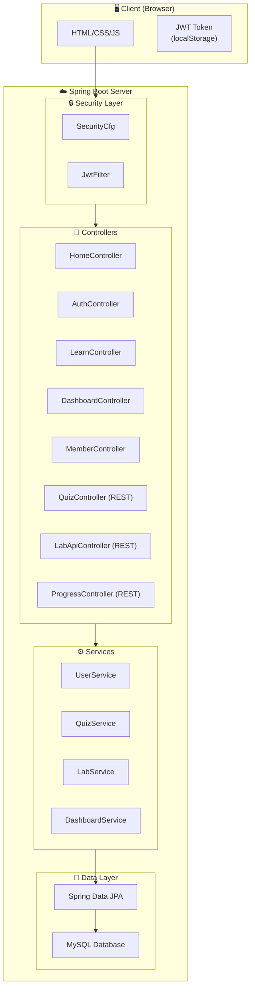

# 📘 Hướng Dẫn Sử Dụng — OWASP Top 10 Cybersecurity Learning Web Application

> **Dự án:** Group 19 — CyberSecurity Learning Web App  

---

## 📑 Mục Lục

1. [Tổng Quan Dự Án](#1-tổng-quan-dự-án)
2. [Công Nghệ Sử Dụng](#2-công-nghệ-sử-dụng)
3. [Yêu Cầu Hệ Thống](#3-yêu-cầu-hệ-thống)
4. [Hướng Dẫn Cài Đặt & Chạy Ứng Dụng](#4-hướng-dẫn-cài-đặt--chạy-ứng-dụng)
5. [Hướng Dẫn Sử Dụng Các Tính Năng](#5-hướng-dẫn-sử-dụng-các-tính-năng)
   - 5.1. [Trang Chủ (Guest)](#51-trang-chủ-guest)
   - 5.2. [Đăng Ký Tài Khoản](#52-đăng-ký-tài-khoản)
   - 5.3. [Đăng Nhập](#53-đăng-nhập)
   - 5.4. [Học — Learn (OWASP Top 10)](#54-học--learn-owasp-top-10)
   - 5.5. [Challenges — Bài Kiểm Tra (Quiz)](#55-challenges--bài-kiểm-tra-quiz)
   - 5.6. [Threat Hunting Simulator — Phòng Lab](#56-threat-hunting-simulator--phòng-lab)
   - 5.7. [Dashboard — Bảng Tổng Quan](#57-dashboard--bảng-tổng-quan)
   - 5.8. [Trang Cá Nhân (Member Profile)](#58-trang-cá-nhân-member-profile)
   - 5.9. [Đăng Xuất](#59-đăng-xuất)
6. [Kiến Trúc Dự Án](#6-kiến-trúc-dự-án)
7. [Danh Sách API](#7-danh-sách-api)
8. [Phân Quyền & Bảo Mật](#8-phân-quyền--bảo-mật)
9. [Câu Hỏi Thường Gặp (FAQ)](#9-câu-hỏi-thường-gặp-faq)
10. [Xử Lý Sự Cố](#10-xử-lý-sự-cố)

---

## 1. Tổng Quan Dự Án

**OWASP Top 10 Cybersecurity Learning Web App** là một nền tảng học tập trực tuyến về bảo mật web, tập trung vào **10 rủi ro bảo mật nghiêm trọng nhất** theo chuẩn OWASP Top 10 (2025). Ứng dụng cung cấp:

| Tính năng | Mô tả |
|-----------|-------|
| 🎓 **Learn** | 10 bài học chi tiết về từng loại rủi ro OWASP (A01–A10) |
| 📝 **Challenges (Quiz)** | Bài kiểm tra trắc nghiệm cho mỗi chủ đề |
| 🔬 **Threat Hunting Simulator** | Lab thực hành mô phỏng tấn công & phòng thủ |
| 📊 **Dashboard** | Bảng tổng quan theo dõi tiến trình học tập |
| 👤 **Profile** | Quản lý thông tin cá nhân người dùng |

### Các chủ đề OWASP Top 10 (2025):

| Mã | Chủ đề |
|----|--------|
| A01 | Broken Access Control |
| A02 | Security Misconfiguration |
| A03 | Software Supply Chain Failures |
| A04 | Cryptographic Failures |
| A05 | Injection |
| A06 | Insecure Design |
| A07 | Authentication Failures |
| A08 | Software or Data Integrity Failures |
| A09 | Security Logging and Monitoring Failures |
| A10 | Server-Side Request Forgery (Exceptional Conditions) |

---

## 2. Công Nghệ Sử Dụng

| Thành phần | Công nghệ |
|------------|-----------|
| **Backend** | Java 21, Spring Boot 3.5.12 |
| **Template Engine** | Thymeleaf |
| **Database** | MySQL |
| **ORM** | Spring Data JPA (Hibernate) |
| **Bảo mật** | Spring Security + JWT (jjwt 0.11.5) |
| **Mã hóa mật khẩu** | BCrypt |
| **Build Tool** | Maven |
| **Frontend** | HTML, CSS, JavaScript (Vanilla) |
| **Font chữ** | Google Fonts (Inter) |

---

## 3. Yêu Cầu Hệ Thống

Trước khi cài đặt, đảm bảo máy tính đã có sẵn:

| Phần mềm | Phiên bản yêu cầu | Kiểm tra |
|-----------|--------------------|----------|
| **Java JDK** | 21 trở lên | `java -version` |
| **Maven** | 3.8+ (hoặc dùng Maven Wrapper trong dự án) | `mvn -version` |
| **MySQL Server** | 8.0+ | `mysql --version` |
| **Git** | Bất kỳ | `git --version` |
| **IDE** (khuyến nghị) | IntelliJ IDEA / VS Code | — |

---

## 4. Hướng Dẫn Cài Đặt & Chạy Ứng Dụng

### Bước 1: Clone dự án

```bash
git clone https://github.com/tunablink/Group_19_CyberSecurityLearingWebApp.git
cd Group_19_CyberSecurityLearingWebApp
```

### Bước 2: Tạo cơ sở dữ liệu MySQL

Mở MySQL client và chạy:

```sql
CREATE DATABASE blogweb;
```

### Bước 3: Cấu hình kết nối database

Mở file `src/main/resources/application.properties` và cập nhật thông tin kết nối phù hợp:

```properties
spring.application.name=blog-web
spring.datasource.url=jdbc:mysql://localhost:3306/blogweb
spring.datasource.username=root
spring.datasource.password=YOUR_PASSWORD_HERE
spring.jpa.hibernate.ddl-auto=update

jwt.secret=mySecretKeyForJwtTokenGenerationAndValidationThatIsLongEnoughForHS512Algorithm!
jwt.expiration-ms=86400000
```

> [!IMPORTANT]
> Thay `YOUR_PASSWORD_HERE` bằng mật khẩu MySQL thực tế của bạn. Cấu hình `ddl-auto=update` sẽ tự động tạo bảng khi ứng dụng chạy lần đầu.

### Bước 4: Build & chạy ứng dụng

**Cách 1 — Dùng Maven Wrapper (khuyến nghị):**

```bash
# Windows
.\mvnw.cmd spring-boot:run

# Linux/macOS
./mvnw spring-boot:run
```

**Cách 2 — Dùng Maven đã cài:**

```bash
mvn spring-boot:run
```

**Cách 3 — Build JAR rồi chạy:**

```bash
mvn clean package -DskipTests
java -jar target/S2026_SE2_Group19-0.0.1-SNAPSHOT.jar
```

### Bước 5: Truy cập ứng dụng

Mở trình duyệt và truy cập:

```
http://localhost:8080
```

> [!TIP]
> Ứng dụng mặc định chạy trên cổng **8080**. Nếu cổng này đã bị sử dụng, bạn có thể thay đổi bằng cách thêm `server.port=XXXX` vào `application.properties`.

---

## 5. Hướng Dẫn Sử Dụng Các Tính Năng

### 5.1. Trang Chủ (Guest)

**URL:** `http://localhost:8080/`

Trang chủ dành cho **khách (chưa đăng nhập)**, bao gồm:

- **Banner Slider:** Hiển thị 3 slide giới thiệu về các tính năng chính (Learn, Quizzes, Labs) với hình ảnh minh họa
- **Tổng quan OWASP Top 10:** 3 thẻ tính năng chính:
  - **LEARN** — Bài học lý thuyết
  - **CHALLENGES** — Bài kiểm tra
  - **THREAT HUNTING SIMULATOR** — Phòng lab thực hành
- **Chi tiết từng phần:** Mô tả sâu hơn với hình ảnh minh họa

**Thanh điều hướng (Navbar Guest)** gồm:
- Logo (về trang chủ)
- Learn → xem bài học dạng khách
- Practice → xem bài học dạng khách
- Compete → yêu cầu đăng nhập
- Education → yêu cầu đăng nhập
- Certifications → yêu cầu đăng nhập
- **Log In** / **Join for FREE** (nút đăng nhập và đăng ký)

---

### 5.2. Đăng Ký Tài Khoản

**URL:** `http://localhost:8080/register`

**Các bước thực hiện:**

1. Nhấn nút **"Join for FREE"** trên thanh điều hướng, hoặc nhấn **"Sign up"** từ trang đăng nhập
2. Điền thông tin:
   - **Username** — Tên đăng nhập (bắt buộc, không trùng lặp)
   - **Password** — Mật khẩu
   - **Confirm password** — Nhập lại mật khẩu
3. Nhấn **"Sign up"**

**Lưu ý:**
- Username phải là duy nhất (nếu đã tồn tại sẽ báo lỗi: *"Username đã tồn tại!"*)
- Mật khẩu xác nhận phải khớp với mật khẩu (nếu không sẽ báo lỗi: *"Mật khẩu xác nhận không khớp!"*)
- Tài khoản mới được gán vai trò **USER** mặc định
- Mật khẩu được mã hóa bằng **BCrypt** trước khi lưu vào database

---

### 5.3. Đăng Nhập

**URL:** `http://localhost:8080/login`

**Các bước thực hiện:**

1. Truy cập trang đăng nhập từ thanh điều hướng (**Log In**)
2. Nhập:
   - **Username or email** — Tên đăng nhập
   - **Password** — Mật khẩu
3. (Tùy chọn) Check **"I'm not a robot"** reCAPTCHA
4. Nhấn **"Log in"**

**Sau khi đăng nhập thành công:**
- Token JWT được lưu vào `localStorage` (key: `auth-key`)
- Tự động chuyển hướng đến trang **Learn** (`/learn`)

**Hỗ trợ đăng nhập khác (UI sẵn):**
- Continue with Google
- Continue with LinkedIn
- Continue with SSO
- Send magic link

> [!NOTE]
> Các phương thức đăng nhập bên thứ ba (Google, LinkedIn, SSO) hiện là giao diện mẫu và chưa được tích hợp backend.

---

### 5.4. Học — Learn (OWASP Top 10)

#### Chế độ Khách (Guest Learn)

**URL:** `http://localhost:8080/learn-guest`

- Truy cập được **không cần đăng nhập**
- Xem nội dung bài học A01–A10 ở dạng đọc
- Không có tính năng theo dõi tiến trình hoặc làm quiz

#### Chế độ Thành Viên (Member Learn)

**URL:** `http://localhost:8080/learn` *(yêu cầu đăng nhập)*

Trang Learn Hub hiển thị 3 phần chính:

```
┌──────────────────────────────────────────────────┐
│  Hero Section                                    │
│  "OWASP Top 10 (2025)"                          │
│  10 Lessons | 10 Quizzes | 10 Labs              │
├──────────────────────────────────────────────────┤
│  📚 LEARN — 10 thẻ bài học                      │
│  ┌─────┐ ┌─────┐ ┌─────┐ ┌─────┐ ┌─────┐       │
│  │ A01 │ │ A02 │ │ A03 │ │ A04 │ │ A05 │       │
│  └─────┘ └─────┘ └─────┘ └─────┘ └─────┘       │
│  ┌─────┐ ┌─────┐ ┌─────┐ ┌─────┐ ┌─────┐       │
│  │ A06 │ │ A07 │ │ A08 │ │ A09 │ │ A10 │       │
│  └─────┘ └─────┘ └─────┘ └─────┘ └─────┘       │
├──────────────────────────────────────────────────┤
│  📝 CHALLENGES — 10 quiz tương ứng              │
├──────────────────────────────────────────────────┤
│  🔬 THREAT HUNTING SIMULATOR — 10 lab           │
└──────────────────────────────────────────────────┘
```

**Cách sử dụng:**

1. **Xem bài học:** Nhấn vào thẻ bài học (ví dụ: *A01 — Broken Access Control*) → mở trang nội dung chi tiết
2. Mỗi bài học bao gồm:
   - Mô tả khái niệm
   - Nguyên nhân & tác động
   - Ví dụ thực tế
   - Biện pháp phòng chống
3. **Xem trước (Preview):** Có thể xem tóm tắt trước khi đọc chi tiết tại `/learn/preview/{id}`

---

### 5.5. Challenges — Bài Kiểm Tra (Quiz)

**URL:** `http://localhost:8080/learn/question/{id}` *(yêu cầu đăng nhập)*

Mỗi chủ đề OWASP có một bài quiz tương ứng:

**Cách làm quiz:**

1. Từ trang Learn, cuộn đến phần **Challenges**
2. Nhấn vào quiz tương ứng (ví dụ: *A01 Quiz — Broken Access Control*)
3. Trả lời các câu hỏi trắc nghiệm
4. Nộp bài → hệ thống tính điểm và ghi nhận kết quả

**API nộp quiz:**
- Endpoint: `POST /api/quizzes/submit`
- Yêu cầu xác thực (JWT / Session)
- Trả về kết quả điểm số

---

### 5.6. Threat Hunting Simulator — Phòng Lab

**URL:** `http://localhost:8080/lab` *(yêu cầu đăng nhập)*

Lab thực hành mô phỏng các kịch bản tấn công web thực tế. Hiện tại có lab hướng dẫn cho **A01: Broken Access Control**.

**Cấu trúc lab gồm 5 bước:**

| Bước | Tên | Mô tả |
|------|-----|-------|
| 01 | Open the Lab | Mở giao diện lab và đọc mục tiêu |
| 02 | Inspect the Profile | Quan sát dữ liệu người dùng hiện tại |
| 03 | Modify the Request | Thay đổi tham số ID trong yêu cầu |
| 04 | Review the Result | Kiểm tra kết quả — dữ liệu trái phép hiển thị |
| 05 | Enable Defense Mode | So sánh hành vi dễ bị tấn công vs. đã được bảo vệ |

**Thanh điều hướng Lab (sidebar):**
- Nhấn từng bước ở thanh bên trái để di chuyển nhanh giữa các bước

**API kiểm tra lab:**
- Endpoint: `POST /api/labs/validate`
- Gửi loại lab và đầu vào → nhận phản hồi xác nhận

---

### 5.7. Dashboard — Bảng Tổng Quan

**URL:** `http://localhost:8080/dashboard` *(yêu cầu đăng nhập)*

Dashboard là trang tổng quan cá nhân, hiển thị:

#### Phần chính (Main):
- **Greeting Card:** Lời chào cá nhân hóa
- **First Room Card:** Hướng dẫn hoàn thành phòng học đầu tiên, với 3 lộ trình:
  - 📖 **Knowledge Only** — Kiến thức lý thuyết
  - ✅ **Knowledge Check Only** — Kiểm tra lý thuyết
  - 🔧 **Practice Only** — Thực hành Lab
- **Bronze League:** Hệ thống xếp hạng (mở khóa khi hoàn thành phòng)
- **Module List:** Danh sách module học tập (tải từ API)

#### Thanh bên (Sidebar):
- **Weekly Mission:** Nhiệm vụ tuần (Answer Questions, Earn Points, Complete Rooms) với thanh tiến trình
- **Questions Answered:** Số câu hỏi đã trả lời trong tuần
- **Your Stats:** Thống kê cá nhân (mở khóa sau khi hoàn thành phòng đầu)

---

### 5.8. Trang Cá Nhân (Member Profile)

**URL:** `http://localhost:8080/member/home` *(yêu cầu đăng nhập)*

Hiển thị thông tin tài khoản đã đăng ký:

| Trường | Mô tả |
|--------|-------|
| **Tên đăng nhập** | Username đã đăng ký |
| **Vai trò** | USER (mặc định) |
| **Địa chỉ** | Địa chỉ (nếu có) |
| **Mã tài khoản** | ID trong hệ thống |

**Tính năng bổ sung:**
- Nút **"Về Dashboard"** để quay lại trang tổng quan
- Phần **Bảo mật** — thông báo liên hệ quản trị viên nếu cần đặt lại mật khẩu

---

### 5.9. Đăng Xuất

Có thể đăng xuất từ:
- **Desktop:** Nút **"Logout"** trên thanh điều hướng (góc phải)
- **Mobile:** Nút **"Logout"** trong menu di động

**Khi đăng xuất:**
- Token JWT bị xóa khỏi `localStorage`
- Chuyển hướng về trang đăng nhập (`/login`)

---

## 6. Kiến Trúc Dự Án

### Cấu trúc thư mục chính

```
Group_19_CyberSecurityLearingWebApp/
├── pom.xml                          # Maven config
├── mvnw, mvnw.cmd                   # Maven Wrapper
├── src/
│   ├── main/
│   │   ├── java/com/example/blog_web/
│   │   │   ├── configs/             # Cấu hình Spring Security, JWT
│   │   │   │   ├── SecurityCfg.java
│   │   │   │   ├── JwtFilter.java
│   │   │   │   └── JwtService.java
│   │   │   ├── controllers/         # Xử lý request
│   │   │   │   ├── HomeController.java        # Trang chủ, login, guest
│   │   │   │   ├── AuthController.java        # Đăng nhập/Đăng ký
│   │   │   │   ├── LearnController.java       # Bài học
│   │   │   │   ├── LabController.java         # Phòng lab
│   │   │   │   ├── DashboardController.java   # Dashboard
│   │   │   │   ├── MemberController.java      # Profile
│   │   │   │   ├── QuizController.java        # API quiz
│   │   │   │   ├── LabApiController.java      # API lab
│   │   │   │   ├── ProgressController.java    # API tiến trình
│   │   │   │   ├── DashboardApiController.java# API dashboard
│   │   │   │   ├── ModuleController.java      # API modules
│   │   │   │   └── UiController.java          # UI components demo
│   │   │   ├── models/              # Entity & DTO
│   │   │   │   └── User.java                  # Entity người dùng
│   │   │   ├── repositories/        # JPA Repository
│   │   │   └── services/            # Business logic
│   │   │       ├── UserService.java
│   │   │       ├── QuizService.java
│   │   │       ├── LabService.java
│   │   │       ├── ModuleService.java
│   │   │       ├── DashboardService.java
│   │   │       ├── CyPromProgressService.java
│   │   │       └── JpaUserDetailsService.java
│   │   └── resources/
│   │       ├── application.properties   # Cấu hình ứng dụng
│   │       ├── static/                  # CSS, Images
│   │       │   ├── css/
│   │       │   └── images/
│   │       └── templates/               # Thymeleaf templates
│   │           ├── index.html           # Trang chủ
│   │           ├── login.html           # Đăng nhập
│   │           ├── register.html        # Đăng ký
│   │           ├── member-home.html     # Profile
│   │           ├── fragments/           # Navbar components
│   │           ├── layouts/             # Layout chung
│   │           ├── learn/               # 10 bài học + quiz + preview
│   │           ├── learn_guest/         # Bài học cho khách
│   │           ├── lab/                 # Lab thực hành
│   │           └── dashboard/           # Dashboard
│   ├── backend/                     # Node.js test scripts (phụ)
│   └── test/                        # Unit tests
└── target/                          # Build output
```

### Mô hình kiến trúc



---

## 7. Danh Sách API

### API REST (yêu cầu xác thực)

| Method | Endpoint | Mô tả | Quyền |
|--------|----------|-------|-------|
| `POST` | `/auth/login` | Đăng nhập, trả về JWT token | Public |
| `POST` | `/register` | Đăng ký tài khoản mới | Public |
| `POST` | `/api/quizzes/submit` | Nộp bài quiz | USER, LEARNER |
| `POST` | `/api/labs/validate` | Kiểm tra đầu vào lab | USER, LEARNER |
| `GET` | `/api/progress/me` | Lấy tiến trình học tập | USER, LEARNER |
| `GET` | `/api/dashboard/learning-path` | Lấy lộ trình học tập | USER, LEARNER |
| `GET` | `/api/modules` | Danh sách tất cả modules | Authenticated |
| `GET` | `/api/modules/{id}` | Chi tiết một module | Authenticated |

### Trang Web (Thymeleaf)

| URL | Mô tả | Quyền |
|-----|-------|-------|
| `/` | Trang chủ | Public |
| `/login` | Trang đăng nhập | Public |
| `/register` | Trang đăng ký | Public |
| `/learn-guest` | Bài học dạng khách | Public |
| `/learn-guest/{id}` | Chi tiết bài học (khách) | Public |
| `/learn` | Learning Hub | Authenticated |
| `/learn/{id}` | Chi tiết bài học | Authenticated |
| `/learn/preview/{id}` | Xem trước bài học | Authenticated |
| `/learn/question/{id}` | Quiz | Authenticated |
| `/lab` | Lab thực hành | Authenticated |
| `/dashboard` | Bảng tổng quan | Authenticated |
| `/member/home` | Trang cá nhân | Authenticated |

---

## 8. Phân Quyền & Bảo Mật

### Các tầng bảo mật:

```
┌─────────────────────────────────────────────────────┐
│ 1. Spring Security Filter Chain                     │
│    ├── JWT Filter (xác thực token)                  │
│    ├── Session Authentication                       │
│    └── CSRF disabled (REST API)                     │
├─────────────────────────────────────────────────────┤
│ 2. URL-based Authorization                          │
│    ├── Public: /, /login, /register, /learn-guest   │
│    ├── USER/LEARNER: /api/dashboard, /api/labs...   │
│    └── Authenticated: /learn, /lab, /dashboard      │
├─────────────────────────────────────────────────────┤
│ 3. Password Encryption                              │
│    └── BCrypt encoding                              │
├─────────────────────────────────────────────────────┤
│ 4. JWT Token                                        │
│    ├── Algorithm: HS512                              │
│    └── Expiration: 24 giờ (86400000 ms)             │
└─────────────────────────────────────────────────────┘
```

### Vai trò người dùng:

| Vai trò | Mô tả |
|---------|-------|
| **Guest** | Xem trang chủ, bài học guest, đăng ký, đăng nhập |
| **USER** | Toàn bộ tính năng: Learn, Quiz, Lab, Dashboard, Profile |
| **LEARNER** | Tương tự USER (trong API dashboard, labs, quizzes) |

---

## 9. Câu Hỏi Thường Gặp (FAQ)

### Q: Tôi có thể học mà không cần đăng ký không?
**A:** Có! Bạn có thể truy cập `/learn-guest` để xem nội dung bài học dạng khách. Tuy nhiên, để làm quiz, lab và theo dõi tiến trình, bạn cần tạo tài khoản.

### Q: Tôi quên mật khẩu, phải làm sao?
**A:** Hiện tại hệ thống chưa có tính năng tự đặt lại mật khẩu. Vui lòng liên hệ quản trị viên để được hỗ trợ.

### Q: Dữ liệu học tập của tôi có được lưu không?
**A:** Có. Kết quả quiz, tiến trình lab và lộ trình học tập đều được lưu trong database MySQL và liên kết với tài khoản của bạn.

### Q: Ứng dụng hỗ trợ mobile không?
**A:** Có. Giao diện được thiết kế responsive và có menu mobile riêng (hamburger menu) cho cả Guest và User.

### Q: JWT token hết hạn thì sao?
**A:** Token JWT có hiệu lực 24 giờ. Khi token hết hạn, bạn sẽ cần đăng nhập lại.

---

## 10. Xử Lý Sự Cố

### ❌ Không kết nối được database

```
Error: Communications link failure
```

**Giải pháp:**
1. Kiểm tra MySQL Server đang chạy: `net start mysql` (Windows) hoặc `sudo service mysql start` (Linux)
2. Xác nhận database `blogweb` đã được tạo
3. Kiểm tra username/password trong `application.properties`
4. Kiểm tra cổng MySQL (mặc định: 3306)

### ❌ Port 8080 đã bị sử dụng

```
Error: Port 8080 was already in use
```

**Giải pháp:** Thêm vào `application.properties`:
```properties
server.port=8081
```

### ❌ Đăng nhập thất bại

**Giải pháp:**
1. Kiểm tra username/password chính xác
2. Mở Console trình duyệt (F12) để xem lỗi chi tiết
3. Kiểm tra server log cho thông báo: `❌ Authentication failed`

### ❌ Trang trắng sau khi đăng nhập

**Giải pháp:**
1. Xóa localStorage: `localStorage.clear()` trong Console
2. Thử đăng nhập lại
3. Kiểm tra cookie session trong trình duyệt

### ❌ Lỗi build Maven

```bash
# Thử xóa cache Maven và build lại
mvn clean install -DskipTests -U
```

---

> [!NOTE]
> **Liên hệ hỗ trợ:** Nếu gặp vấn đề khác, vui lòng tạo Issue trên GitHub repository hoặc liên hệ nhóm phát triển Group 19.
